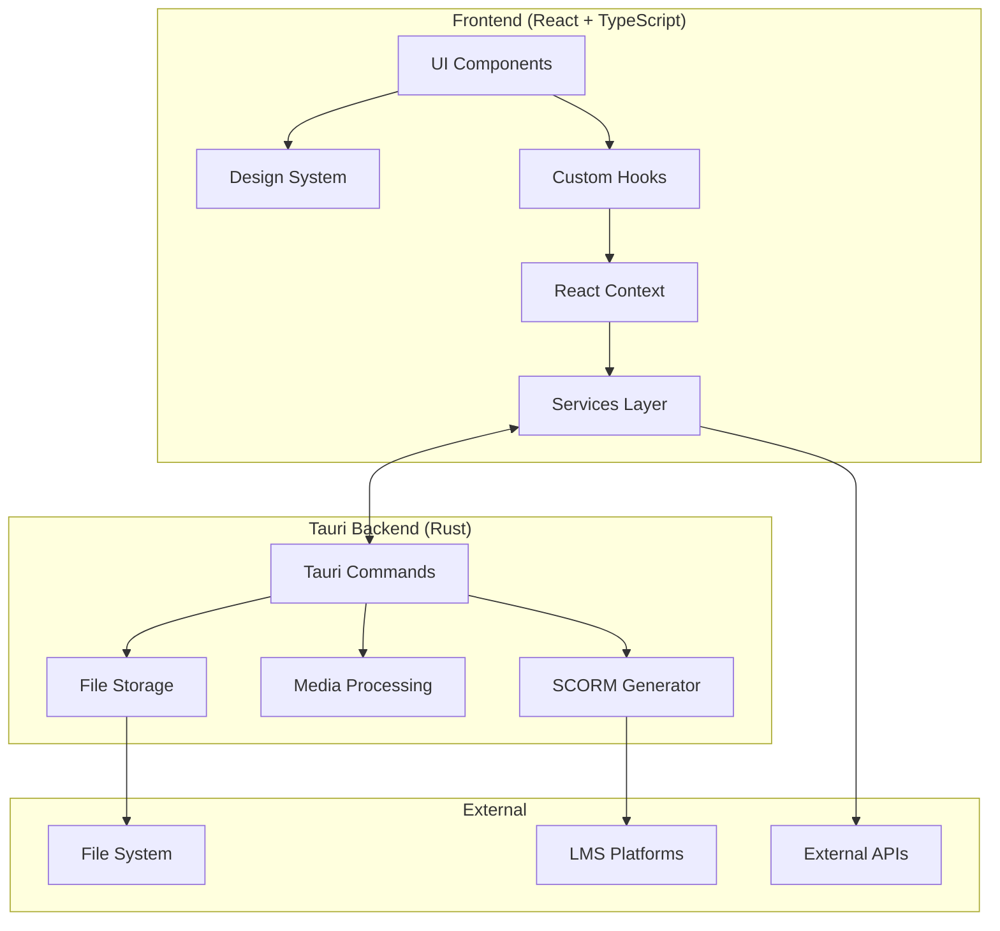

# SCORM Course Builder

<div align="center">
  
  
  
  ### 🎓 Professional E-Learning Course Creation Made Simple
  
  [](https://github.com/drelor-online/scorm-builder/releases)
  [](https://github.com/drelor-online/scorm-builder/actions)
  [](./scorm-builder/coverage)
  [](./scorm-builder)
  [](LICENSE)
  
  A modern, AI-powered desktop and web application for creating SCORM-compliant e-learning packages with an intuitive 7-step wizard interface.

  [**Download Latest Release**](https://github.com/drelor-online/scorm-builder/releases/latest) | [**Live Demo**](#) | [**Documentation**](./scorm-builder/docs)

</div>

---

## ✨ Key Features

### 🚀 **Intuitive 7-Step Course Creation Wizard**
- **Step 1: Course Configuration** - Set up your course with pre-built templates
- **Step 2: AI Prompt Generation** - Generate course content with AI assistance
- **Step 3: JSON Import/Validation** - Import and validate course structure
- **Step 4: Media Enhancement** - Add images, videos, and YouTube content
- **Step 5: Audio Narration** - Record or upload audio narration with captions
- **Step 6: Content Editing** - Rich text editor for final content refinement
- **Step 7: SCORM Package Generation** - Export SCORM 1.2 compliant packages

### 📦 **Desktop Application**
- **Cross-platform** support (Windows, macOS, Linux)
- **Offline capability** - Work without internet connection
- **Native file system** integration
- **Auto-save** functionality
- **Project management** with .scormproj files

### 🎯 **SCORM Compliance**
- **SCORM 1.2** fully compliant packages
- **Progress tracking** and completion status
- **Assessment scoring** with customizable pass marks
- **Mobile-responsive** output
- **LMS compatibility** tested with Moodle, Canvas, and SCORM Cloud

### 🎨 **Modern User Experience**
- **Clean, professional** interface
- **Dark/Light mode** support
- **Accessibility** (WCAG 2.1 AA compliant)
- **Keyboard navigation** throughout
- **Real-time preview** of course content

## 📥 Installation

### Desktop Application (Recommended)

#### Windows
Download and install using one of these options:

| Package | Size | Description |
|---------|------|-------------|
| [**Portable Edition**](https://github.com/drelor-online/scorm-builder/releases/download/v1.0.0/SCORM-Builder-Portable-v1.0.0-Win64.zip) | 4.0 MB | No installation required, run from anywhere |
| [**MSI Installer**](https://github.com/drelor-online/scorm-builder/releases/download/v1.0.0/SCORM.Course.Builder_1.0.0_x64_en-US.msi) | 5.6 MB | Standard Windows installer |
| [**NSIS Installer**](https://github.com/drelor-online/scorm-builder/releases/download/v1.0.0/SCORM.Course.Builder_1.0.0_x64-setup.exe) | 4.2 MB | Setup wizard with options |

**System Requirements:**
- Windows 10/11 (64-bit)
- 4GB RAM minimum (8GB recommended)
- 500MB free disk space
- WebView2 Runtime (auto-installed if missing)

#### macOS & Linux
Coming soon! For now, use the development setup below.

### Development Setup

#### Prerequisites
- **Node.js** 18.0 or higher
- **npm** 9.0 or higher (or yarn/pnpm)
- **Rust** 1.70 or higher (for Tauri desktop app)
- **Git** for version control

#### Quick Start
```bash
# Clone the repository
git clone https://github.com/drelor-online/scorm-builder.git
cd scorm-builder

# Install dependencies
cd scorm-builder
npm install

# Run in development mode
npm run dev              # Web version at http://localhost:5173
npm run tauri:dev       # Desktop application

# Run tests
npm test                # Run test suite
npm run test:coverage   # Generate coverage report

# Build for production
npm run build           # Web build
npm run tauri:build    # Desktop application
```

## 🏗️ Architecture

### Technology Stack

#### Frontend
- **React 19** - UI framework
- **TypeScript 5.7** - Type safety
- **Vite 6** - Build tool and dev server
- **Vitest** - Unit and integration testing
- **CSS Modules** - Scoped styling
- **Framer Motion** - Animations
- **DOMPurify** - XSS protection

#### Desktop (Tauri)
- **Tauri v2** - Desktop framework
- **Rust** - Backend logic
- **WebView2** (Windows) - Web rendering
- **File System API** - Native file operations

#### Key Libraries
- **React Router** - Navigation
- **Quill** - Rich text editor
- **JSZip** - SCORM package creation
- **html2canvas** - Thumbnail generation
- **Lucide React** - Icons

### Project Structure
```
scorm-builder/
├── src/                      # Frontend source code
│   ├── components/           # React components
│   │   ├── DesignSystem/    # Reusable UI components
│   │   └── __tests__/       # Component tests
│   ├── services/            # Business logic & API
│   ├── hooks/               # Custom React hooks
│   ├── contexts/            # React contexts
│   ├── utils/               # Utility functions
│   └── types/               # TypeScript definitions
├── src-tauri/               # Tauri backend (Rust)
│   ├── src/
│   │   ├── commands.rs     # Tauri commands
│   │   ├── media_storage.rs # Media handling
│   │   └── scorm/          # SCORM generation
│   └── capabilities/       # Security permissions
├── public/                  # Static assets
├── docs/                    # Documentation
└── tests/                   # E2E and integration tests
```

### Architecture Diagram


## 📚 Usage Guide

### Creating Your First Course

1. **Launch the Application**
   - Desktop: Double-click the application icon
   - Web: Navigate to `http://localhost:5173`

2. **Create a New Project**
   - Click "New Project" on the dashboard
   - Enter your course title
   - Select a template (Professional, Academic, Corporate Training)

3. **Follow the 7-Step Wizard**
   - Each step builds upon the previous
   - Use "Save Project" to save progress anytime
   - Navigate between steps using the sidebar

4. **Generate SCORM Package**
   - Review your course in the preview
   - Click "Generate SCORM Package"
   - Choose download location
   - Upload to your LMS

### Working with Media

#### Supported Formats
- **Images**: JPG, PNG, GIF, SVG, WebP
- **Videos**: MP4, WebM, YouTube URLs
- **Audio**: MP3, WAV, OGG
- **Captions**: VTT, SRT

#### Media Management
- Drag & drop upload
- Bulk operations support
- Automatic optimization
- YouTube video embedding
- AI-powered image search (requires API key)

### Testing SCORM Packages

#### ⚠️ Important: Browser Security
Direct browser testing (file://) has limitations due to security restrictions.

#### Recommended Testing Methods

1. **Local Web Server** (Best for Development)
```bash
# Python
cd extracted-scorm-package/
python -m http.server 8000

# Node.js
npx http-server extracted-scorm-package/ -p 8000

# Access at http://localhost:8000
```

2. **SCORM Cloud** (Most Accurate)
   - Free account at [cloud.scorm.com](https://cloud.scorm.com)
   - Upload your .zip package
   - Test with real SCORM runtime

3. **LMS Platform**
   - Upload to Moodle, Canvas, or other LMS
   - Test actual learner experience

## 🧪 Testing

### Test Statistics
- **Total Tests**: 1,195
- **Passing**: 1,161 (97.2%)
- **Coverage**: 83.34%
- **Test Files**: 400+

### Running Tests
```bash
# Unit tests
npm test

# With coverage
npm run test:coverage

# Watch mode
npm test -- --watch

# Specific file
npm test -- AudioNarrationWizard

# E2E tests
npm run test:e2e

# BDD tests
npm run test:bdd
```

### Test-Driven Development (TDD)
This project follows strict TDD practices:

1. **RED** - Write failing test first
2. **GREEN** - Implement minimal code to pass
3. **REFACTOR** - Improve code quality

All pull requests must include tests for new features.

## 🔧 Configuration

### API Keys (Optional)
Enable advanced features by adding API keys:

1. Open Settings in the application
2. Add your API credentials:
   - **Google Images**: API Key + Custom Search Engine ID
   - **YouTube**: Data API v3 Key
   - **AI Generation**: OpenAI/Anthropic API Key

### Environment Variables
Create `.env` file in `scorm-builder/`:
```env
VITE_GOOGLE_IMAGE_API_KEY=your_key_here
VITE_GOOGLE_CSE_ID=your_cse_id_here
VITE_YOUTUBE_API_KEY=your_key_here
```

## 📊 Performance

### Metrics
- **Lighthouse Score**: 89/100
- **Bundle Size**: ~157 KB (gzipped)
- **Initial Load**: < 2 seconds
- **Test Execution**: < 30 seconds
- **Build Time**: ~45 seconds

### Optimizations
- Code splitting and lazy loading
- Image optimization and WebP support
- Efficient re-renders with React.memo
- Virtual scrolling for large lists
- Web Worker for heavy computations

## 🤝 Contributing

We welcome contributions! Please follow these guidelines:

### Development Workflow
1. Fork the repository
2. Create feature branch (`git checkout -b feature/amazing-feature`)
3. Write tests first (TDD mandatory)
4. Implement your feature
5. Ensure all tests pass
6. Commit with conventional commits
7. Push to your fork
8. Open a Pull Request

### Commit Convention
```
type(scope): description

feat: new feature
fix: bug fix
docs: documentation
test: testing
refactor: code refactoring
style: formatting
chore: maintenance
```

### Code Standards
- TypeScript strict mode enabled
- ESLint rules enforced
- Prettier formatting required
- 80% minimum test coverage
- Accessibility compliance (WCAG 2.1 AA)

## 🔒 Security

### Security Features
- Content Security Policy (CSP) enabled
- XSS protection via DOMPurify
- Path traversal prevention
- Input validation and sanitization
- Secure file operations
- No sensitive data in logs

### Reporting Security Issues
Please report security vulnerabilities to [security email] instead of public issues.

## 📦 Deployment

### GitHub Actions CI/CD
- Automated testing on all PRs
- Build validation
- Release automation
- Security scanning

### Release Process
1. Version bump in package.json
2. Update CHANGELOG.md
3. Create git tag
4. Push to master
5. GitHub Actions creates release

## 🆘 Troubleshooting

### Common Issues

#### "Failed to load project"
- Check file permissions
- Verify .scormproj file integrity
- Try opening in a different browser/app

#### "Media not displaying"
- Ensure media files are under 50MB
- Check supported formats
- Clear browser cache

#### "SCORM package not working in LMS"
- Verify SCORM 1.2 compatibility
- Check LMS upload limits
- Test in SCORM Cloud first

### Getting Help
- [Documentation](./scorm-builder/docs)
- [GitHub Issues](https://github.com/drelor-online/scorm-builder/issues)
- [Discussions](https://github.com/drelor-online/scorm-builder/discussions)

## 📄 License

This project is licensed under the MIT License - see the [LICENSE](LICENSE) file for details.

## 🙏 Acknowledgments

- [Tauri](https://tauri.app) - Desktop framework
- [React](https://react.dev) - UI library
- [Vite](https://vitejs.dev) - Build tool
- [SCORM](https://scorm.com) - E-learning standard
- All our contributors and users!

## 📈 Project Status

### Current Version: 1.0.0
- ✅ Core functionality complete
- ✅ Windows desktop app released
- ✅ SCORM 1.2 compliance verified
- ✅ 97.2% test passing rate
- 🚧 macOS/Linux apps in development
- 🚧 SCORM 2004 support planned

### Roadmap
- [ ] macOS and Linux desktop apps
- [ ] SCORM 2004 support
- [ ] Cloud sync functionality
- [ ] Collaborative editing
- [ ] Mobile companion app
- [ ] AI content generation improvements
- [ ] More course templates
- [ ] Multilingual support

---

<div align="center">
  
  **Built with ❤️ by the SCORM Builder Team**
  
  [Website](#) | [Documentation](./scorm-builder/docs) | [Support](#)
  
</div>